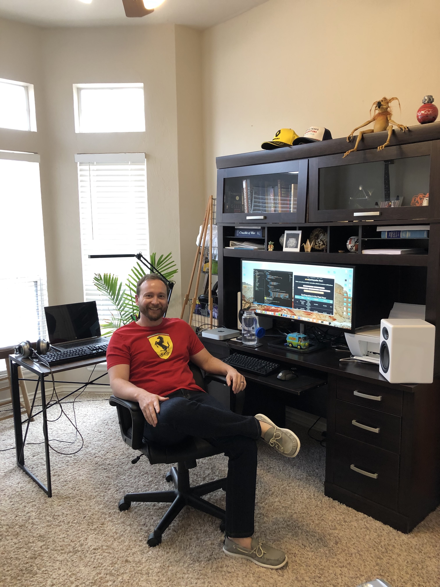
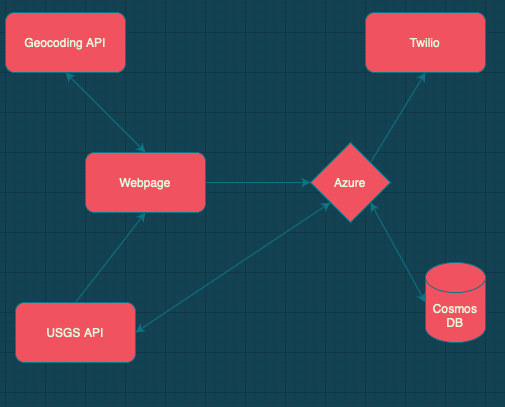
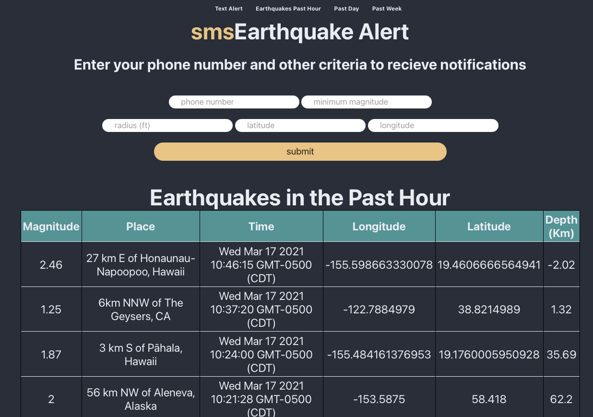
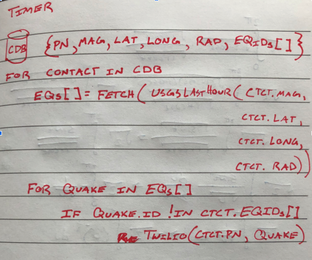
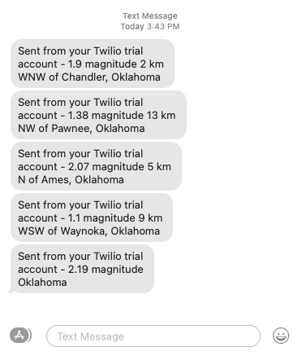

1.

**Abstract:**

In November of 2011 a record setting 5.7 magnitude earthquake occured in central Oklahoma, rattling buildings and the nerves of residents throughout the state.  Prior to this, earthquakes were quite rare in my home state, but it is now one of the most seismically active areas in the US.  Fortunately the majority of these quakes are quite small and regulations have been imposed on waste water injection wells to mitigate their occurence, but they do still occur.  I previously worked as a geologist, so admitedly have more than a passing interest in the frequency and scale of these quakes, and often find myself at the USGS website searching for the magnitude of the last earthquake I've felt. So I created my web app, smsEarthquake Alert.

 Unfortunately there is no way to predict earthquakes before they happen and mother nature will be the first to let you know when the big one hits.  But my web app monitors real time earthquake data provided by the USGS and using location and other cutoff critera a user specifies, will send a text message informing the user about a quake's magnitude, epicenter and depth shortly after it occurs.

2.

   

3.


4.

smsEarthquake Alert monitors real time earthquake data provided by the USGS. Using location and other cutoff criteria a user specifies it will send a text message informing the user about a quake's magnitude, epicenter and depth shortly after it occurs.

5.

**Step-by-step blog**

Hello! My name is Jeff Roden and I am a non-traditional student at Oklahoma State University.  I previously worked as a geologist for the past 10 years and am currently in the middle of a career pivot to software engineering.  When it came time to choose a personal project, I knew that I wanted to blend my past experience into mine somehow.  So I decided to make smsEarthquake Alert!  It is a web app that utilizes Microsoft Azure functions, Cosmos DB, Twilio, and an API from the USGS that provides real time earthquake data.  A text message is then sent out letting you know the location and magnitude of a recent earthquake in an area of interest decided on by the user.

**smsEarthquake Alert Flowchart**



I decided to start on what I was most familiar with, building out a simple static website for people to sign up for the service.  The main purpose here is to collect a users phone number to receive a text, as well as the smallest earthquake size to be notified about (minimum magnitude) and a latitude, longitude and radius around that location in miles the earthquake needs to occur in.  Once the user enters in their critera and hits submit, the form data is sent to an Azure HTTP trigger function that takes that data and stores it into Cosmos DB.  I was going to use the Geocoding API so a user could just enter a city name and state instead of lat/long's, but that will have to wait for version 2!

Just for a little extra info I also decided to display a table showing earthquakes that have happened world-wide in the past hour, day, and week using data from the USGS API.

**Sign-up Page**



**Sign-up Page HTML**

```html
<!DOCTYPE html>
<html lang="en">
<head>
    <meta charset="UTF-8">
    <meta http-equiv="X-UA-Compatible" content="IE=edge">
    <meta name="viewport" content="width=device-width, initial-scale=1.0">
    <title>smsEarthquake Alert</title>
    <link rel="stylesheet" href="style.css">
</head>
<body>
   <div class="main">
        <div class="nav">
            <ul>
                <li><a href="#text">Text Alert</a></li>
                <li><a href="#hour">Earthquakes Past Hour</a></li>
                <li><a href="#day">Past Day</a></li>
                <li><a href="#week">Past Week</a></li>
              </ul>
        </div>
       <div class="main-container">
            <header class="main-header">
                <a name="text"></a>
                <h1>
                    <span class="tan">sms</span>Earthquake Alert
                </h1>
                <h2>Enter your phone number and other criteria to recieve notifications</h2>
            </header>
            <div class="form">
                <form method="POST" id="formsub" action="https://smsearthquake.azurewebsites.net/api/HttpTrigger1_subForm?code=BPBzT9AZmQdk4y9TEuPFgUv2VsHZ2910zP9Parws3XaYnhldorfRJA==">    
                    <input type="text" id="phoneNum" class="input-phoneNum" placeholder="phone number" autocomplete="off"></input>
                    <input type="text" id="mag" class="input-mag" placeholder="minimum magnitude" autocomplete="off"></input><br>
                    <input type="text" id="radius" class="input-radius" placeholder="radius (ft)" autocomplete="off"></input>
                    <input type="text" id="lat" class="input-lat" placeholder="latitude" autocomplete="off"></input>
                    <input type="text" id="long" class="input-long" placeholder="longitude" autocomplete="off"></input><br>
                    <button id="submit-button" class="submit-button">submit</button>
                </form>
            </div>
            <div class="table-hour">
                <a name="hour"></a>
                <h1>Earthquakes in the Past Hour</h1>
                <table class="table">
                    <tr class="eq-info">
                        <th>Magnitude</th>
                        <th>Place</th>
                        <th>Time</th>
                        <th>Longitude</th>
                        <th>Latitude</th>
                        <th>Depth (Km)</th>
                    </tr>
                    <tbody id="hourData">
                    </tbody>
                </table>
            </div>
            <div class="table-day">
                <a name="day"></a>
                <h1>Earthquakes in the Past Day</h1>
                <table class="table">
                    <tr class="eq-info">
                        <th>Magnitude</th>
                        <th>Place</th>
                        <th>Time</th>
                        <th>Longitude</th>
                        <th>Latitude</th>
                        <th>Depth (Km)</th>
                    </tr>
                    <tbody id="dayData">
                    </tbody>
                </table>
            </div>
       </div>
    </div>
</body>
</html>
<script src="bc.js" type="text/javascript"></script>
```

**Sign-up Page Javascript**

```javascript
//Collecting Form data and Posting it to my HTTP Trigger
var formsub = document.getElementById('formsub');
var button = document.getElementById('submit-button');
var phoneNum = document.getElementById('phoneNum');
var mag = document.getElementById('mag');
var lat = document.getElementById('lat');
var long = document.getElementById('long');
var radius = document.getElementById('radius');

button.addEventListener('click', function (ev) {
    
    ev.preventDefault();
    ev.stopPropagation();
    var body = {
        "phoneNum": phoneNum.value,
        "lat": lat.value,
        "long": long.value,
        "radius": radius.value,
        "magnitude": mag.value
    }
    fetch("http://localhost:7071/api/formsSubmit", {
        method: "POST",
        headers: {
            "content-type": "application/json"
        },
        body: JSON.stringify(body)
    })
});

//Populating Tables with recent EQ data
fetch('https://earthquake.usgs.gov/earthquakes/feed/v1.0/summary/all_hour.geojson').then(
    res => {
        res.json().then(
            data => {
                var temp = "";
                data.features.forEach(u => {
                    temp += "<tr>";
                    temp += "<td>" + Math.round(u.properties.mag * 1e2) / 1e2 + "</td>";
                    temp += "<td>" + u.properties.place + "</td>";
                    var utcSeconds = u.properties.time;
                    var d = new Date(utcSeconds);
                    temp += "<td>" + d + "</td>";
                    temp += "<td>" + u.geometry.coordinates[0] + "</td>";
                    temp += "<td>" + u.geometry.coordinates[1] + "</td>";
                    temp += "<td>" + Math.round(u.geometry.coordinates[2] * 1e2) / 1e2 + "</td></tr>";
                })
                document.getElementById("hourData").innerHTML = temp;
                console.log(data);
            }
        )
    }
)
```

**Azure Function HTTP Trigger**

I have an azure HTTP trigger that takes the form data pushed from my html page, adds an empty earthquake ID array to it, then sends it on its way to be stored in Cosmos DB.  This empty eqID array was needed so I can keep track of what earthquakes someone has already been notified about so they dont get repeat texts about the same quake!

```javascript
module.exports = async function (context, req) {
    
    const contact = req.body;
    contact.eqID = []
    context.bindings.outputDocument = contact;

}
```


**Azure Function HTTP Timer**

Now for the hard part!  I needed to pull a user contact from my Cosmos DB, then fetch a list of earthquakes from the USGS API that met the contact's lat/long/radius and magnitude criteria.

I then cycle through this list of earthquakes and check the unique ID assigned to each quake by the USGS agaisnt an array of eqID's the user has already been texted about.  If the ID isn't in that list, they get a message about it listing the size and approximate location texted to them through Twilio.

This was a lot for me to process at first so I started out by just writing some pseudo-code to get a grip on how I needed to structure the logic.




Now my solution uses a double nested for loop, so will be O(n^2).  I am sure there is a more efficient solution than this, but its what I ran with for now ;-)

Logic structure in hand I then set out to put all of this in action through an Azure HTTP trigger function that executes every 10 minutes to check for new quakes!

```javascript
const fetch = require('node-fetch');

//Beginning of the Timer function
module.exports = async function (context, myTimer, contacts) {
//arrays used for the twilio message body and updating the cosmos DB with quake IDs.
    var messages = [];
    var documentsToSave = [];
  
 //Pulling a contact from Cosmos and getting their EQ criteria into vars to make a fetch request
    for(var contact of contacts) {
        var startTime = new Date().toISOString().substring(0,10);
     
//As Americans we are used to using miles, but the USGS API deals in kilometers, so I convert a users desired radius from miles to kilometers before making the fetch call to the USGS.
        var maxradiusKm = contact.radius * 1.60934;
        var fetchUrl = "https://earthquake.usgs.gov/fdsnws/event/1/query?format=geojson&starttime=" 
                + startTime + "&latitude="
                + contact.lat + "&longitude="
                + contact.long + "&maxradiuskm="
                + maxradiusKm + "&minmagnitude="
                + contact.magnitude;
        var response = await fetch(fetchUrl);
      
//We now have an array of earthquakes that have happened in the users desired area  
      var EQs = await response.json();
        
        EQs.features.forEach(quake => {
            const quakeMag = Math.round(quake.properties.mag * 1e2) / 1e2;
            const place = quake.properties.place;
			
//Checking here to make sure its a new quake, and not one previously notified about
//If its new one, a text is sent out 
            if(contact.eqID.includes[quake.id] == false)
                messages.push({
                    body: quakeMag.toString() +" magnitude "+ place,
                    to: "+1"+contact.phoneNum
                }); 
                context.bindings.messages = messages;
                contact.eqID.push(quake.id);
                documentsToSave.push(contact);
        });
        context.bindings.outputDocument = documentsToSave;
    } 
};
```


In Oklahoma, suprisingly, it usually doesn't take long for a quake to happen these days!  Now, we just have to sit and be patient and wait for mother nature to stretch it's legs.. err plates? But there's no plate boundaries in Oklahoma you exclaim? .... ok you're right, but that is a whole different blog post :-)   Regardless, now we sit and wait for a bit!

**Getting Notifications from Twilio**

Here is a screen grab from my phone letting me know about earthquakes that have happened within 100 miles of where I live, Oklahoma City:



As you can see, we already had a handfull of tiny earthquakes before 4 pm for that day.

**Conclusion**

I've learned a ton on this project.  I came in to this with very minimal front-end experience and felt pretty overwhelmed at first.  It is always easy to start a project and then kind of just lose focus and stop.  In this regard the Bit Project was excellent in keeping me on task and having people here to not only help me figure all this stuff out, but to also keep me accountable and on track!

Special thanks to my mentor Anthony Chu, who carried me out of many holes and frustrating dead ends I fell into while putting this together and also to the Bit Project serverless intructors Emily, Evelyn, and Julia!

And also a thousand thank you's to everyone that devotes their time and effort in making this project happen!